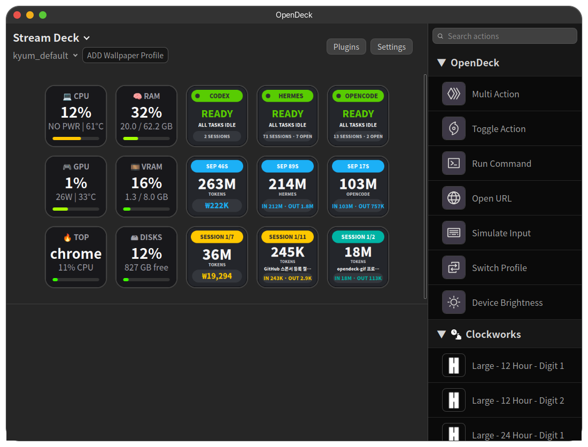

# OpenDeck-GIF

[English](#english) | [한국어](#한국어)

An [OpenDeck](https://github.com/nekename/OpenDeck) fork that plays **animated GIFs** on Stream Deck keys.

[OpenDeck](https://github.com/nekename/OpenDeck)를 포크하여 **버튼에서 애니메이션 GIF를 재생**할 수 있게 만든 버전입니다.



---

<a id="english"></a>
## English

### What this fork changes

- **Animated GIFs on keys**: when a key's image is a `.gif`, it is played frame-by-frame on the device, honoring per-frame delays (stop-motion style, looped). Otherwise it falls back to a static render like upstream.
- **Works everywhere images come from**:
  - images picked/dropped in the profile editor (stored as data URLs), and
  - images stored as files under `~/.config/opendeck/images/<device>/<profile>/<slot>/` (e.g. profiles that reference `0.gif`).
- **Same rendering rules as static images**: keys are composited on a 144×144 canvas with the configured background color and image scale, and text overlay and other key settings keep working.
- **Safe file handling**: profile-referenced image paths are resolved only inside OpenDeck's config directory.
- Everything else — plugins, profiles, encoders, multi-actions — behaves like upstream OpenDeck.

### Requirements

- Linux (this fork is developed and tested on Ubuntu 24.04; other distributions should work the same way)
- Rust (stable toolchain) and Deno

### Step-by-step installation

#### 1) Install system build dependencies

**Ubuntu / Debian**

```bash
sudo apt update
sudo apt install -y build-essential curl git file \
  libwebkit2gtk-4.1-dev libgtk-3-dev libayatana-appindicator3-dev \
  libudev-dev libssl-dev libdbus-1-dev librsvg2-dev libxdo-dev
```

**Fedora**

```bash
sudo dnf install -y gcc gcc-c++ make git file \
  webkit2gtk4.1-devel gtk3-devel libayatana-appindicator-gtk3-devel \
  libudev-devel openssl-devel dbus-devel librsvg2-devel libxdo-devel
```

**Arch Linux**

```bash
sudo pacman -S --needed base-devel git file \
  webkit2gtk-4.1 gtk3 libayatana-appindicator libusb openssl dbus
```

**openSUSE** — install the `devel_basis` pattern plus the WebKitGTK 4.1 / GTK3 / udev / SSL / D-Bus development packages, or follow [Tauri's prerequisites](https://tauri.app/start/prerequisites/) for your distribution.

Package names can differ between distro versions; when in doubt, follow [Tauri v2's prerequisites page](https://tauri.app/start/prerequisites/) for your distribution.

#### 2) Install Rust

```bash
curl --proto '=https' --tlsv1.2 -sSf https://sh.rustup.rs | sh
source "$HOME/.cargo/env"
```

#### 3) Install Deno

```bash
curl -fsSL https://deno.land/install.sh | sh
```

(Or see the [Deno docs](https://docs.deno.com/runtime/getting_started/installation/) for other methods.)

#### 4) Clone and build

```bash
git clone https://github.com/sudo-redyell/OpenDeck-gif.git
cd OpenDeck-gif
deno task tauri build
```

The binary is produced at `src-tauri/target/release/opendeck`.

To run directly from source during development:

```bash
deno task tauri dev
```

#### 5) Install udev rules (device access)

```bash
sudo cp src-tauri/bundle/40-streamdeck.rules /etc/udev/rules.d/40-streamdeck.rules
sudo udevadm control --reload-rules
sudo udevadm trigger
```

Unplug and re-plug your Stream Deck afterwards.

#### 6) Make `opendeck` available on PATH (optional)

```bash
mkdir -p "$HOME/.local/bin"
cp src-tauri/target/release/opendeck "$HOME/.local/bin/"
```

`~/.local/bin` is normally already on your PATH.

### Using animated GIFs

1. Open a key (or a Multi Action sub-button) in the profile editor.
2. Drop or select a `.gif` file as the key image.
3. The key now plays the GIF in a loop automatically. Frame order, per-frame delays and transparent/background handling are taken from the GIF itself.

Profiles that already reference `.gif` files inside the `images/` folder keep playing once the profile opens — no need to re-select the image.

## Credits & License

- **Upstream project**: [OpenDeck](https://github.com/nekename/OpenDeck) by [nekename](https://github.com/nekename) (Aman Khanna), licensed under the **GNU General Public License v3 or later**. All credit and thanks for the original software belong to the upstream author and contributors — please consider supporting them ([GitHub Sponsors](https://github.com/sponsors/nekename)).
- **This fork**: modifications © 2026 sudo-redyell, distributed under the **same GPL-3.0-or-later** license. The original [`LICENSE.md`](LICENSE.md) is kept unchanged in this repository.
- **Upstream README**: for the full upstream feature list, installation options (.deb/.rpm/AUR/Flathub), screenshots and documentation, see the [original README](https://github.com/nekename/OpenDeck#readme).
- **Dependencies**: Rust/Tauri ecosystem crates (tauri, elgato-streamdeck, image, ...) are used under their own respective licenses — see [Cargo.toml](src-tauri/Cargo.toml) and the crates' repositories.
- **Disclaimer**: This project is not affiliated with, or endorsed by, Elgato. "Elgato" and "Stream Deck" are trademarks of Elgato Systems GmbH.

---

<a id="한국어"></a>
## 한국어

### 이 포크의 변경 사항

- **버튼에서 GIF 애니메이션 재생**: 키 이미지가 `.gif`면 기기에서 프레임 단위로 반복 재생합니다. 프레임별 지연 시간(딜레이)을 그대로 반영합니다.
- **이미지 경로 어디서 와도 동작**:
  - 프로필 편집기에서 선택/드롭한 이미지(data URL로 저장됨),
  - `~/.config/opendeck/images/<기기>/<프로필>/<슬롯>/` 아래 파일로 저장된 이미지(예: `0.gif`를 참조하는 프로필).
- **정적 이미지와 동일한 렌더링 규칙**: 144×144 캔버스, 배경색, 이미지 스케일 설정을 그대로 적용하며 텍스트 오버레이 등 다른 설정도 동작합니다.
- **안전한 파일 처리**: 프로필이 참조하는 이미지 경로는 OpenDeck 설정 디렉터리 내부만 읽도록 제한됩니다.
- 그 외 모든 기능(플러그인, 프로필, 인코더, Multi Actions 등)은 원본 OpenDeck과 동일합니다.

### 요구 사항

- Linux (이 포크는 Ubuntu 24.04에서 개발·테스트됨; 다른 배포판도 동일한 방식으로 동작합니다)
- Rust (stable)와 Deno

### 설치 방법 (Step by Step)

#### 1) 시스템 빌드 의존성 설치

**Ubuntu / Debian**

```bash
sudo apt update
sudo apt install -y build-essential curl git file \
  libwebkit2gtk-4.1-dev libgtk-3-dev libayatana-appindicator3-dev \
  libudev-dev libssl-dev libdbus-1-dev librsvg2-dev libxdo-dev
```

**Fedora**

```bash
sudo dnf install -y gcc gcc-c++ make git file \
  webkit2gtk4.1-devel gtk3-devel libayatana-appindicator-gtk3-devel \
  libudev-devel openssl-devel dbus-devel librsvg2-devel libxdo-devel
```

**Arch Linux**

```bash
sudo pacman -S --needed base-devel git file \
  webkit2gtk-4.1 gtk3 libayatana-appindicator libusb openssl dbus
```

**openSUSE** — `devel_basis` 패턴과 WebKitGTK 4.1 / GTK3 / udev / SSL / D-Bus 개발 패키지를 설치하거나, [Tauri 사전 요구 사항](https://tauri.app/start/prerequisites/) 문서를 참고하세요.

패키지 이름은 배포판·버전에 따라 다를 수 있습니다. 애매하면 [Tauri v2 사전 요구 사항](https://tauri.app/start/prerequisites/) 페이지를 우선하세요.

#### 2) Rust 설치

```bash
curl --proto '=https' --tlsv1.2 -sSf https://sh.rustup.rs | sh
source "$HOME/.cargo/env"
```

#### 3) Deno 설치

```bash
curl -fsSL https://deno.land/install.sh | sh
```

(다른 설치 방법은 [Deno 공식 문서](https://docs.deno.com/runtime/getting_started/installation/) 참고)

#### 4) 클론 및 빌드

```bash
git clone https://github.com/sudo-redyell/OpenDeck-gif.git
cd OpenDeck-gif
deno task tauri build
```

빌드 결과물은 `src-tauri/target/release/opendeck` 위치에 생성됩니다.

개발 중 소스에서 바로 실행하려면:

```bash
deno task tauri dev
```

#### 5) udev 규칙 설치 (기기 접근 권한)

```bash
sudo cp src-tauri/bundle/40-streamdeck.rules /etc/udev/rules.d/40-streamdeck.rules
sudo udevadm control --reload-rules
sudo udevadm trigger
```

설치 후 Stream Deck을 분리했다가 다시 연결하세요.

#### 6) PATH에 opendeck 등록 (선택)

```bash
mkdir -p "$HOME/.local/bin"
cp src-tauri/target/release/opendeck "$HOME/.local/bin/"
```

`~/.local/bin`은 보통 PATH에 이미 포함되어 있습니다.

### GIF 사용 방법

1. 프로필 편집기에서 키(또는 Multi Action 하위 버튼)를 엽니다.
2. 키 이미지로 `.gif` 파일을 드롭하거나 선택합니다.
3. 이후부터 해당 키는 GIF를 자동으로 반복 재생합니다. 프레임 순서와 프레임별 딜레이, 투명/배경 처리는 GIF 내부 정보를 따릅니다.

이미 `images/` 폴더의 `.gif` 파일을 참조하는 기존 프로필은 프로필을 열기만 하면 다시 이미지를 선택하지 않아도 재생됩니다.

## 출처 & 라이선스

- **원본 프로젝트**: [OpenDeck](https://github.com/nekename/OpenDeck) — [nekename](https://github.com/nekename) (Aman Khanna) 저작, **GNU GPL v3 이상** 라이선스. 원본 소프트웨어에 대한 모든 크레딧과 감사는 원작자와 기여자에게 돌아갑니다. 원작자 후원도 고려해 주세요 ([GitHub Sponsors](https://github.com/sponsors/nekename)).
- **이 포크**: 수정 사항 © 2026 sudo-redyell. 원본과 **동일한 GPL-3.0-or-later** 조건으로 배포됩니다. 원본 [`LICENSE.md`](LICENSE.md)는 변경 없이 그대로 유지됩니다.
- **원본 README**: 원본의 전체 기능 목록, 설치 방식(.deb/.rpm/AUR/Flathub), 스크린샷·문서는 [원본 README](https://github.com/nekename/OpenDeck#readme)를 참고하세요.
- **의존성**: Rust/Tauri 생태계 크레이트(tauri, elgato-streamdeck, image 등)는 각자의 라이선스를 따릅니다 — [Cargo.toml](src-tauri/Cargo.toml)과 각 크레이트 저장소를 참고하세요.
- **면책**: 이 프로젝트는 Elgato와 제휴하거나 승인받지 않았습니다. "Elgato"와 "Stream Deck"은 Elgato Systems GmbH의 상표입니다.
